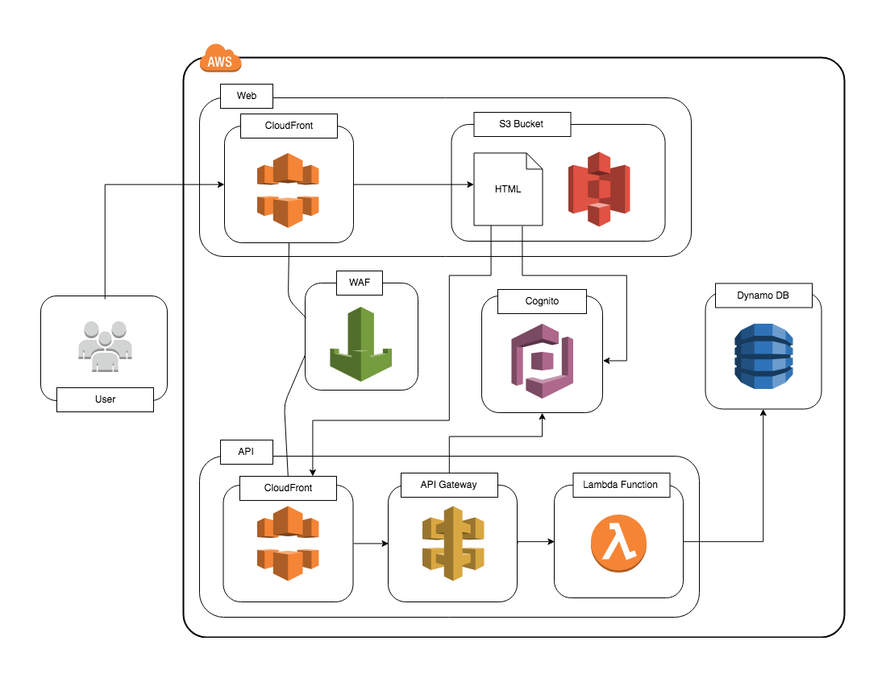
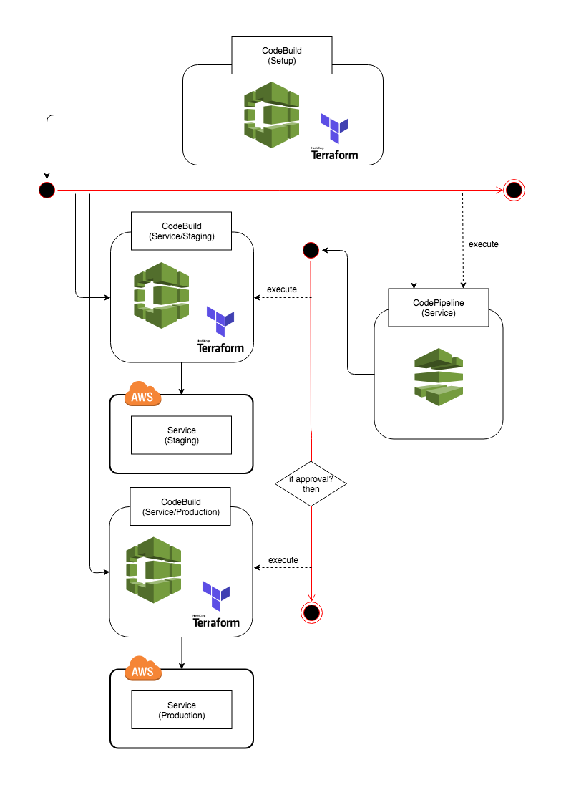
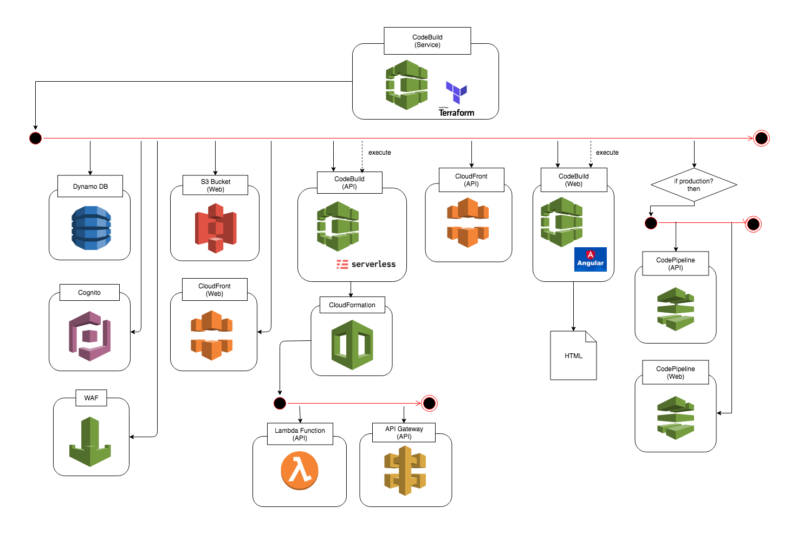
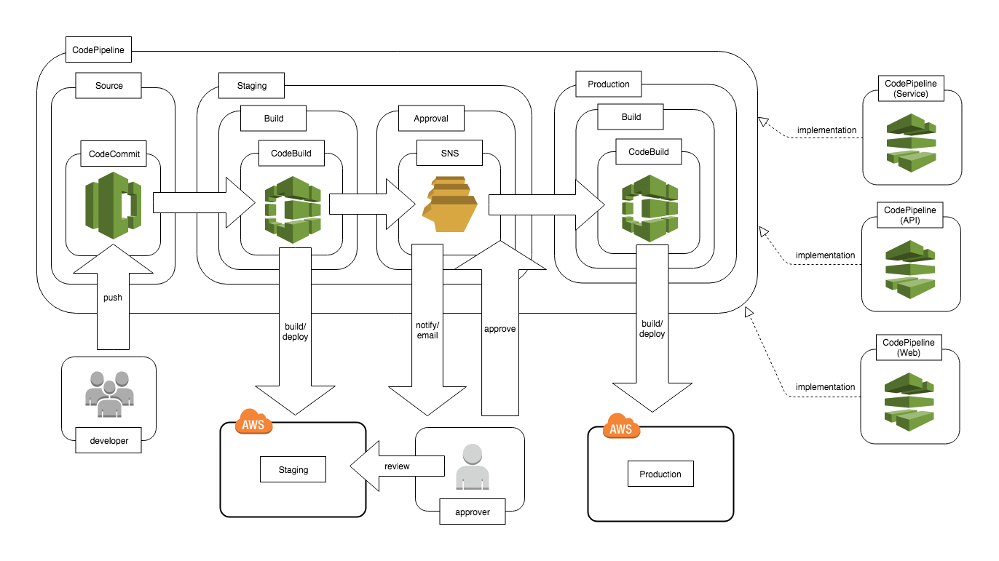

# AWS Serverless SPA(Single Page Application) Sample: Build infrastructure with Terraform

[](https://circleci.com/gh/nihemak/aws-sls-spa-sample-terraform/tree/master)

This is a sample to build infrastructure of AWS serverless SPA service with Terraform.
The repositories for sample of SPA services are [API](https://github.com/nihemak/aws-sls-spa-sample-api) and [Web](https://github.com/nihemak/aws-sls-spa-sample-web).

## Service Architecture



## Build Flow (Staging and Production)

CodeBuild of setup:



CodeBuild of service:



CodePipeline:



## Getting Started (Development)

Migrate a Github repository to AWS CodeCommit.

Create an AWS CodeCommit Repository:

```bash
# spa infra repository...
$ aws codecommit create-repository --repository-name foobar-sample-spa-infra
# spa api repository...
$ aws codecommit create-repository --repository-name foobar-sample-spa-api
# spa web repository...
$ aws codecommit create-repository --repository-name foobar-sample-spa-web
```

Clone the Repository and Push to the AWS CodeCommit Repository:

```bash
# spa infra repository...
$ git clone --mirror https://github.com/nihemak/aws-sls-spa-sample-terraform.git sample-spa-infra
$ cd sample-spa-infra
$ git push ssh://git-codecommit.ap-northeast-1.amazonaws.com/v1/repos/foobar-sample-spa-infra --all
$ git push ssh://git-codecommit.ap-northeast-1.amazonaws.com/v1/repos/foobar-sample-spa-infra --tags
$ cd ..
# spa api repository...
$ git clone --mirror https://github.com/nihemak/aws-sls-spa-sample-api.git sample-spa-api
$ cd sample-spa-api
$ git push ssh://git-codecommit.ap-northeast-1.amazonaws.com/v1/repos/foobar-sample-spa-api --all
$ git push ssh://git-codecommit.ap-northeast-1.amazonaws.com/v1/repos/foobar-sample-spa-api --tags
$ cd ..
# spa web repository...
$ git clone --mirror https://github.com/nihemak/aws-sls-spa-sample-web.git sample-spa-web
$ cd sample-spa-web
$ git push ssh://git-codecommit.ap-northeast-1.amazonaws.com/v1/repos/foobar-sample-spa-web --all
$ git push ssh://git-codecommit.ap-northeast-1.amazonaws.com/v1/repos/foobar-sample-spa-web --tags
$ cd ..
```

Create S3 bucket for Terraform state saving:

```bash
$ aws s3 mb s3://foobar-sample-spa-dev-terraform-state --region ap-northeast-1
$ aws s3api put-bucket-versioning --bucket foobar-sample-spa-dev-terraform-state \
                                  --versioning-configuration Status=Enabled
```

Create CodeBuild's service role for development:

```bash
$ cat Trust-Policy.json
{
    "Version": "2012-10-17",
    "Statement": [
        {
            "Effect": "Allow",
            "Principal": {
                "Service": "codebuild.amazonaws.com"
            },
            "Action": "sts:AssumeRole"
        }
    ]
}
$ aws iam create-role --role-name foobar-sample-spa-dev-codebuild \
                      --assume-role-policy-document file://Trust-Policy.json
$ aws iam attach-role-policy --policy-arn arn:aws:iam::aws:policy/AdministratorAccess \
                             --role-name foobar-sample-spa-dev-codebuild
```

Create CodeBuild for development:

```bash
$ cat Source.json
{
  "type": "CODECOMMIT",
  "location": "https://git-codecommit.ap-northeast-1.amazonaws.com/v1/repos/foobar-sample-spa-infra",
  "buildspec": "buildspec_development.yml"
}
$ cat Artifacts.json
{
  "type": "NO_ARTIFACTS"
}
$ cat Environment.json
{
  "type": "LINUX_CONTAINER",
  "image": "aws/codebuild/ubuntu-base:14.04",
  "computeType": "BUILD_GENERAL1_SMALL",
  "environmentVariables": [
    {
      "name": "TF_VAR_service_name",
      "value": "foobar-sample-spa",
      "type": "PLAINTEXT"
    },
    {
      "name": "TF_VAR_s3_bucket_terraform_state_id",
      "value": "foobar-sample-spa-dev-terraform-state",
      "type": "PLAINTEXT"
    },
    {
      "name": "TF_VAR_codecommit_api_repository",
      "value": "foobar-sample-spa-api",
      "type": "PLAINTEXT"
    },
    {
      "name": "TF_VAR_codecommit_web_repository",
      "value": "foobar-sample-spa-web",
      "type": "PLAINTEXT"
    },
    {
      "name": "codecommit_api_branch",
      "value": "<branch of api>",
      "type": "PLAINTEXT"
    },
    {
      "name": "codecommit_web_branch",
      "value": "<branch of web>",
      "type": "PLAINTEXT"
    }
  ]
}
$ aws codebuild create-project --name foobar-sample-spa-dev \
                               --source file://Source.json \
                               --artifacts file://Artifacts.json \
                               --environment file://Environment.json \
                               --service-role arn:aws:iam::<account-id>:role/foobar-sample-spa-dev-codebuild
```

Build development.

Run CodeBuild to build infrastructure and api and web with Terraform:

```bash
$ aws codebuild start-build --project-name foobar-sample-spa-dev --source-version <branch of infrastructure>
```

## Getting Started (Staging and Production)

Migrate a Github repository to AWS CodeCommit.

Create an AWS CodeCommit Repository:

```bash
# spa infra repository...
$ aws codecommit create-repository --repository-name foobar-sample-spa-infra
# spa api repository...
$ aws codecommit create-repository --repository-name foobar-sample-spa-api
# spa web repository...
$ aws codecommit create-repository --repository-name foobar-sample-spa-web
```

Clone the Repository and Push to the AWS CodeCommit Repository:

```bash
# spa infra repository...
$ git clone --mirror https://github.com/nihemak/aws-sls-spa-sample-terraform.git sample-spa-infra
$ cd sample-spa-infra
$ git push ssh://git-codecommit.ap-northeast-1.amazonaws.com/v1/repos/foobar-sample-spa-infra --all
$ git push ssh://git-codecommit.ap-northeast-1.amazonaws.com/v1/repos/foobar-sample-spa-infra --tags
$ cd ..
# spa api repository...
$ git clone --mirror https://github.com/nihemak/aws-sls-spa-sample-api.git sample-spa-api
$ cd sample-spa-api
$ git push ssh://git-codecommit.ap-northeast-1.amazonaws.com/v1/repos/foobar-sample-spa-api --all
$ git push ssh://git-codecommit.ap-northeast-1.amazonaws.com/v1/repos/foobar-sample-spa-api --tags
$ cd ..
# spa web repository...
$ git clone --mirror https://github.com/nihemak/aws-sls-spa-sample-web.git sample-spa-web
$ cd sample-spa-web
$ git push ssh://git-codecommit.ap-northeast-1.amazonaws.com/v1/repos/foobar-sample-spa-web --all
$ git push ssh://git-codecommit.ap-northeast-1.amazonaws.com/v1/repos/foobar-sample-spa-web --tags
$ cd ..
```

Setup Required for Build infrastructure with AWS CodeBuild.

Create an SNS topic for approval of AWS CodePipeline:

```bash
$ aws sns create-topic --name foobar-sample-spa-approval-topic
$ aws sns subscribe --topic-arn arn:aws:sns:ap-northeast-1:<account-id>:foobar-sample-spa-approval-topic \
                    --protocol email \
                    --notification-endpoint <your email>
# and confirm...
$ aws sns confirm-subscription --topic-arn arn:aws:sns:ap-northeast-1:<account-id>:foobar-sample-spa-approval-topic \
                               --token <token value>
```

Create S3 bucket for Terraform state saving:

```bash
$ aws s3 mb s3://foobar-sample-spa-terraform-state --region ap-northeast-1
$ aws s3api put-bucket-versioning --bucket foobar-sample-spa-terraform-state \
                                  --versioning-configuration Status=Enabled
```

Create CodeBuild's service role for setup:

```bash
$ cat Trust-Policy.json
{
    "Version": "2012-10-17",
    "Statement": [
        {
            "Effect": "Allow",
            "Principal": {
                "Service": "codebuild.amazonaws.com"
            },
            "Action": "sts:AssumeRole"
        }
    ]
}
$ aws iam create-role --role-name foobar-sample-spa-setup-codebuild \
                      --assume-role-policy-document file://Trust-Policy.json
$ aws iam attach-role-policy --policy-arn arn:aws:iam::aws:policy/AdministratorAccess \
                             --role-name foobar-sample-spa-setup-codebuild
```

Create CodeBuild for setup:

```bash
$ cat Source.json
{
  "type": "CODECOMMIT",
  "location": "https://git-codecommit.ap-northeast-1.amazonaws.com/v1/repos/foobar-sample-spa-infra",
  "buildspec": "buildspec_setup.yml"
}
$ cat Artifacts.json
{
  "type": "NO_ARTIFACTS"
}
$ cat Environment.json
{
  "type": "LINUX_CONTAINER",
  "image": "aws/codebuild/ubuntu-base:14.04",
  "computeType": "BUILD_GENERAL1_SMALL",
  "environmentVariables": [
    {
      "name": "TF_VAR_service_name",
      "value": "foobar-sample-spa",
      "type": "PLAINTEXT"
    },
    {
      "name": "TF_VAR_approval_sns_topic_arn",
      "value": "arn:aws:sns:ap-northeast-1:<account-id>:foobar-sample-spa-approval-topic",
      "type": "PLAINTEXT"
    },
    {
      "name": "TF_VAR_s3_bucket_terraform_state_id",
      "value": "foobar-sample-spa-terraform-state",
      "type": "PLAINTEXT"
    },
    {
      "name": "TF_VAR_codecommit_infra_repository",
      "value": "foobar-sample-spa-infra",
      "type": "PLAINTEXT"
    },
    {
      "name": "TF_VAR_codecommit_api_repository",
      "value": "foobar-sample-spa-api",
      "type": "PLAINTEXT"
    },
    {
      "name": "TF_VAR_codecommit_web_repository",
      "value": "foobar-sample-spa-web",
      "type": "PLAINTEXT"
    }
  ]
}
$ aws codebuild create-project --name foobar-sample-spa-setup \
                               --source file://Source.json \
                               --artifacts file://Artifacts.json \
                               --environment file://Environment.json \
                               --service-role arn:aws:iam::<account-id>:role/foobar-sample-spa-setup-codebuild
```

Setup and Build infrastructure.

Run CodeBuild to build infrastructure with Terraform:

```bash
$ aws codebuild start-build --project-name foobar-sample-spa-setup
```
